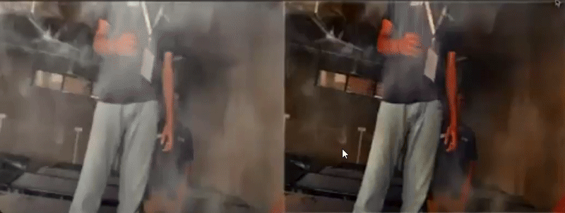
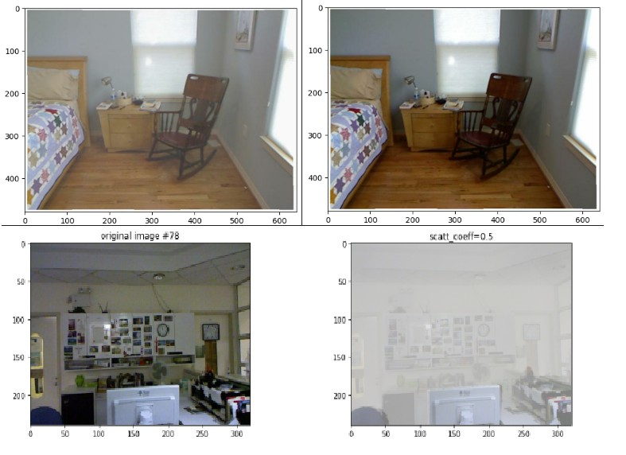

# 🔥 Real-Time Intelligent Dehazing and Human Detection for Fire Rescue Operations

> Finalist - Smart India Hackathon 2023  
> 🥉 3rd Place - Encender 2024

---

## 📽️ Demo



> Real-time rescue vision demo in a simulated smoke environment

---

## 📌 Overview

This project addresses the critical challenge of reduced visibility in smoke-obscured environments during fire rescue operations.

It combines:
- 💡 **Deep learning-based dehazing** using a custom CNN (HazeNet)
- 👀 **Human detection** using YOLOv5
- 🎥 **Real-time video processing** via webcam input

The system enhances the visibility of smoke-filled frames and detects survivors in real-time, aiding first responders during search-and-rescue missions.

---

## 📂 Project Structure

```
├── generate_data.ipynb         # Collects webcam images and applies histogram dehazing (for rapid prototyping)
├── ImageDehazing.ipynb         # Real-time pipeline with HazeNet + YOLOv5 integration
├── test1.py                    # Generates synthetic hazy dataset using depth maps
├── hazenet.pth                 # Trained weights for HazeNet
├── demo.gif                    # Real-time demonstration (simulated smoke environment)
├── comparison.jpg              # Side-by-side sample of hazy vs dehazed image
└── README.md                   # You're here
```

---

## 🧪 Dataset Generation

To train and evaluate HazeNet, a synthetic haze dataset was generated using the IndoorCVPR_09 dataset. Depth maps were used to simulate haze using physical models:

\[
I(x) = J(x) \cdot e^{-\beta d(x)} + A \cdot (1 - e^{-\beta d(x)})
\]

✅ Output includes:
- Clean images
- Hazy images
- Transmission maps
- Scattering coefficient and airlight values

> See: `test1.py` for code  
> Format: `.mat` files (HDF5)

---

## 🧠 HazeNet: Custom CNN for Dehazing

HazeNet is a compact CNN trained on the generated dataset to learn single-image dehazing.

**Features**:
- Lightweight and fast
- Trained using PyTorch
- Produces visually enhanced outputs under smoky conditions

```python
model = HazeNet()
model.load_state_dict(torch.load('hazenet.pth'))
```

---

## 🧑‍🚒 Real-Time Pipeline



1. **Capture live video** via webcam
2. **Dehaze** frames using HazeNet
3. **Detect humans** using pretrained YOLOv5 (COCO class ID 0)
4. **Display output** with bounding boxes

```python
results = yolo(dehazed_frame)
cv2.imshow("Rescue Vision", results.render())
```

---

## 📈 Performance

| Feature           | Details                     |
|------------------|-----------------------------|
| FPS (Real-time)  | ~15–30 (YOLOv5s + HazeNet)  |
| Object Classes   | Human (class 0 - COCO)      |
| Platform         | PyTorch + OpenCV            |
| Evaluation       | Qualitative + visual        |

---

## 🏆 Achievements

- ✅ Selected as **Finalist** at **Smart India Hackathon 2023**
- 🥉 Won **3rd place** at **Encender 2024** (Technical Hackathon)
- Demonstrated live in a **smoke simulation chamber** for judges

---

## 🚀 Future Scope

| Area | Suggestion |
|------|------------|
| Dehazing | Use advanced architectures (AOD-Net, GridDehazeNet) |
| Data | Use real fire-scene videos (e.g., FLIR) |
| Metrics | Quantify with PSNR, SSIM, mAP |
| Deployment | Convert to ONNX or TensorRT for Jetson Nano |

---


---

## 📜 License

This project is for academic and non-commercial research purposes only.

